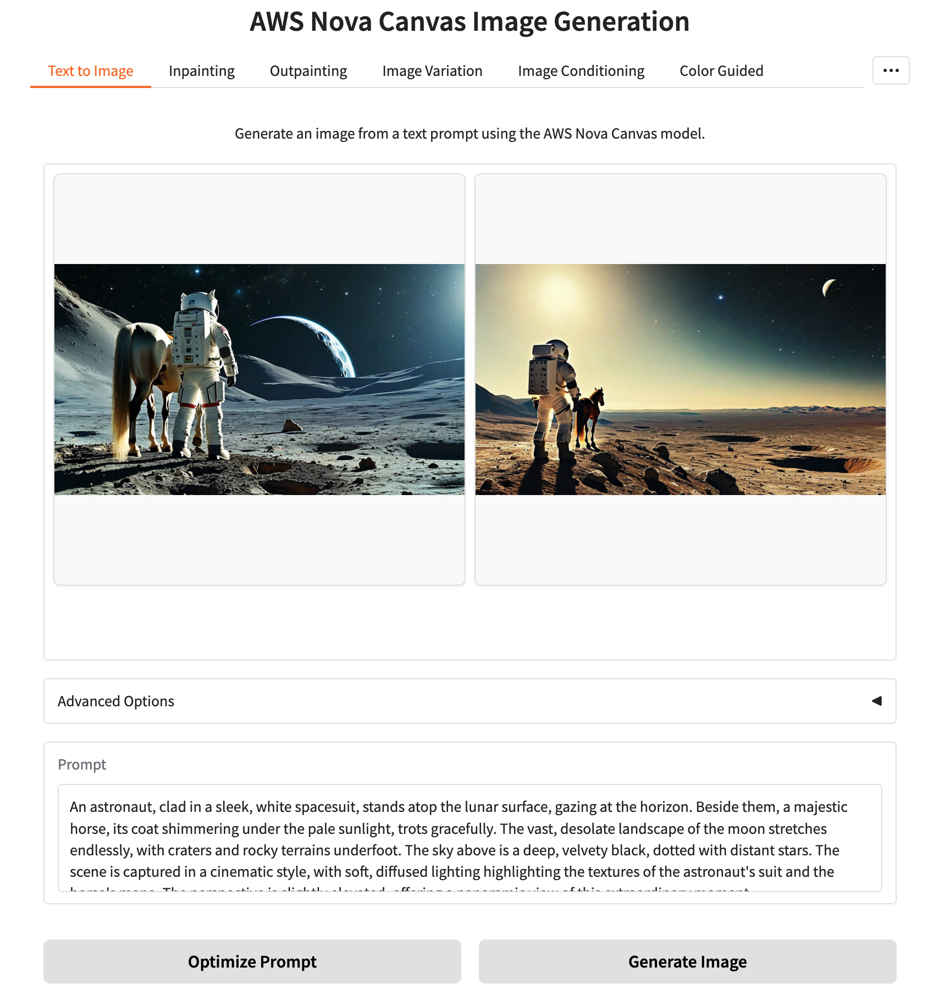

# Nova Canvas Demo App

This repository contains a demo application that showcases Amazon Nova Canvas. The application is deployed using AWS Cloud Development Kit (CDK).



## Architecture Overview

The Nova Canvas Demo App consists of:

- **App Runner Service**: Hosts the application container
- **S3 Bucket**: Stores application data
- **Secrets Manager**: Manages application passwords
- **IAM Roles**: Provides necessary permissions

## Prerequisites

Before deploying the application, ensure you have the following:

- AWS CLI configured with appropriate credentials
- Python 3.9 or later
- AWS CDK v2 installed
- Docker installed and running (for building the container image)

## Project Structure

```
aws-nova-canvas-demo/
├── app/                  # Application code and Dockerfile
├── cdk/                  # CDK deployment code
│   ├── stacks/           # CDK stack definitions
│   │   └── app_runner_stack.py  # Main stack for App Runner service
│   ├── cdk_app.py        # CDK application entry point
│   └── cdk.json          # CDK configuration
└── README.md             # This file
```

## Deployment Instructions

### 1. Install Dependencies

Navigate to the CDK directory and install the required dependencies:

```bash
cd cdk
pip install -r requirements.txt
```

### 2. Bootstrap CDK (First-time only)

If you haven't used CDK in the selected AWS region before, you need to bootstrap it:

```bash
cdk bootstrap aws://ACCOUNT-NUMBER/REGION
```

### 3. Deploy the Application

Deploy the application using CDK:

```bash
cdk deploy
```

During deployment, CDK will:
- Build a Docker image from the application code
- Create an S3 bucket stores generated images
- Create a Secrets Manager secret for the application password
- Deploy an App Runner service with the Docker image
- Configure IAM roles and permissions

### 4. Accessing the Application

After successful deployment, the CDK will output:
- **AppRunnerServiceURL**: The URL to access your application
- **AppPasswordSecretName**: The name of the secret containing the application password
- **S3BucketName**: The name of the S3 bucket created for the application

**Default login username is "demo".**

You can retrieve the application password from Secrets Manager:

```bash
aws secretsmanager get-secret-value --secret-id [AppPasswordSecretName] --query SecretString --output text
```

## Environment Variables

The application uses the following environment variables:

- **AWS_REGION**: The AWS region where the application is deployed
- **PASSWORD_SECRET_NAME**: The name of the Secrets Manager secret containing the application password
- **S3_BUCKET_NAME**: The name of the S3 bucket for storing application data

## Infrastructure Details

### App Runner Service

The App Runner service is configured with:
- 2 vCPU and 4 GB memory
- Auto-scaling from 1 to 5 instances
- TCP health checks

### S3 Bucket

The S3 bucket is configured with:
- Versioning enabled
- Public access blocked
- Retention policy set to RETAIN (bucket will not be deleted when stack is deleted)

### IAM Permissions

The application has permissions to:
- Access Amazon Bedrock services
- Perform read/write operations on the S3 bucket
- Retrieve secrets from Secrets Manager

## Cleanup

To remove all resources created by this application:

```bash
cdk destroy
```

**Note**: The S3 bucket will not be automatically deleted due to the RETAIN removal policy. You will need to manually delete the bucket if desired.

## Troubleshooting

- **Deployment Failures**: Check CloudFormation events in the AWS Console
- **Application Errors**: Check App Runner logs
- **Permission Issues**: Verify IAM roles and policies

## Security Considerations

- The application uses a dedicated S3 bucket with restricted permissions
- All public access to the S3 bucket is blocked
- Secrets are stored in AWS Secrets Manager
- IAM permissions follow the principle of least privilege
